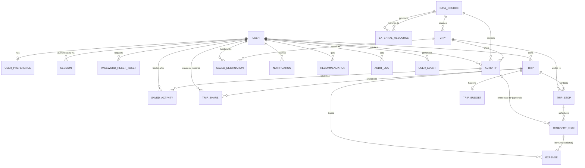

# Schemas

Reference for the Prisma schema in `apps/express/prisma/schema.prisma`.

## Overview

The backend uses **PostgreSQL via Prisma**. All canonical entities — users,
trips, cities, activities, budgets, expenses, and so on — are stored locally.
External providers (OSM/Overpass today; others later) are **data sources** that
create or enrich these entities. They are never a prerequisite: the app works
fully against its own database regardless of external API availability.

This is enforced by the `DataSource` + `ExternalResource` pattern: every
externally-sourced row points back to a registered `DataSource`, and raw
provider payloads / sync metadata live in `ExternalResource` rather than
polluting the domain models.

## ER overview

## Enums

| Enum               | Values |
| ------------------ | ------ |
| `UserRole`         | `USER`, `ADMIN` |
| `UserStatus`       | `ACTIVE`, `SUSPENDED`, `DELETED` |
| `TripStatus`       | `DRAFT`, `PLANNED`, `ONGOING`, `COMPLETED`, `CANCELLED` |
| `TripVisibility`   | `PRIVATE`, `SHARED`, `PUBLIC` |
| `SharePermission`  | `VIEW`, `EDIT` |
| `ExpenseCategory`  | `TRANSPORT`, `ACCOMMODATION`, `ACTIVITY`, `FOOD`, `OTHER` |
| `EventType`        | `CITY_SEARCHED`, `CITY_VIEWED`, `CITY_SAVED`, `ACTIVITY_VIEWED`, `ACTIVITY_SAVED`, `ACTIVITY_ADDED`, `TRIP_CREATED`, `TRIP_UPDATED`, `TRIP_SHARED`, `BUDGET_VIEWED`, `ITINERARY_UPDATED` |

All primary keys are UUID strings (`@default(uuid()) @db.Uuid`). Timestamps:
`createdAt @default(now())`, `updatedAt @updatedAt` unless noted.

---

## Tables

### Identity & Personalization

#### User

Registered account. Soft-deleted via `deletedAt`; status/role control access.

| Field           | Type         | Constraints |
| --------------- | ------------ | ----------- |
| `id`            | Uuid         | PK, default uuid |
| `email`         | String       | unique |
| `passwordHash`  | String       | required |
| `firstName`     | String       | required |
| `lastName`      | String       | required |
| `displayName`   | String?      | nullable |
| `avatarUrl`     | String?      | nullable |
| `role`          | UserRole     | default `USER` |
| `status`        | UserStatus   | default `ACTIVE` |
| `emailVerified` | Boolean      | default `false` |
| `lastLoginAt`   | DateTime?    | nullable |
| `deletedAt`     | DateTime?    | soft delete marker |

Relations: `preference` (1:1), `trips`, `createdActivities`, `savedDestinations`,
`savedActivities`, `userEvents`, `notifications`, `recommendations`,
`tripShares` (created), `receivedShares`, `auditLogs`, `sessions`,
`passwordResetTokens`.

#### UserPreference

One-to-one personalization profile per user.

| Field                 | Type    | Constraints |
| --------------------- | ------- | ----------- |
| `id`                  | Uuid    | PK |
| `userId`              | Uuid    | unique, FK → User, cascade delete |
| `preferredCurrency`   | String  | required |
| `language`            | String  | default `"en"` |
| `travelStyle`         | String? | nullable |
| `budgetLevel`         | String? | nullable |
| `preferredCategories` | Json?   | nullable |
| `homeCountry`         | String? | nullable |

#### Session

Bearer tokens for authenticated sessions.

| Field       | Type      | Constraints |
| ----------- | --------- | ----------- |
| `id`        | Uuid      | PK |
| `userId`    | Uuid      | FK → User, cascade delete, indexed |
| `token`     | String    | unique |
| `expiresAt` | DateTime  | required |

#### PasswordResetToken

Single-use reset tokens with expiry.

| Field       | Type      | Constraints |
| ----------- | --------- | ----------- |
| `id`        | Uuid      | PK |
| `userId`    | Uuid      | FK → User, cascade delete, indexed |
| `token`     | String    | unique |
| `expiresAt` | DateTime  | required |
| `usedAt`    | DateTime? | nullable once consumed |

### Data Sources

#### DataSource

Registry of external providers (e.g. OSM/Overpass). Identified by a stable
`code`; can be deactivated with `isActive` without deleting history.

| Field       | Type     | Constraints |
| ----------- | -------- | ----------- |
| `id`        | Uuid     | PK |
| `code`      | String   | unique |
| `name`      | String   | required |
| `type`      | String   | provider type |
| `baseUrl`   | String?  | nullable |
| `isActive`  | Boolean  | default `true` |

Relations: `externalResources`, sourced `cities`, `activities`.

#### ExternalResource

Polymorphic join between any entity and its external counterpart.

| Field           | Type      | Constraints |
| --------------- | --------- | ----------- |
| `id`            | Uuid      | PK |
| `dataSourceId`  | Uuid      | FK → DataSource, cascade delete, indexed |
| `entityType`    | String    | e.g. `"City"`, `"Activity"` |
| `entityId`      | Uuid      | PK of the local entity |
| `externalId`    | String    | ID at the source |
| `sourceUrl`     | String?   | nullable |
| `rawData`       | Json?     | last raw payload from the provider |
| `lastSyncedAt`  | DateTime? | nullable until first sync |

Indexes on `(entityType, entityId)` and `dataSourceId`. Deleting an entity does
not automatically clean these rows (no FK to the target table).

### Catalog

#### City

Destination record. Always attributed to a data source (even if seeded
internally), and may have zero activities.

| Field                | Type          | Constraints |
| -------------------- | ------------- | ----------- |
| `id`                 | Uuid          | PK |
| `sourceDataSourceId` | Uuid          | FK → DataSource, cascade delete, indexed |
| `name`               | String        | required |
| `country`            | String        | required |
| `countryCode`        | String        | required |
| `region`             | String?       | nullable |
| `description`        | String?       | nullable |
| `imageUrl`           | String?       | nullable |
| `latitude`           | Decimal(10,7)? | nullable |
| `longitude`          | Decimal(10,7)? | nullable |
| `costIndex`          | Decimal(8,2)? | nullable |
| `popularityScore`    | Decimal(5,2)  | default `0` |
| `viewCount`          | Int           | default `0` |
| `saveCount`          | Int           | default `0` |
| `tripCount`          | Int           | default `0` |
| `metadata`           | Json?         | nullable |

Relations: `activities`, `tripStops`, `savedBy` (SavedDestination).

#### Activity

Thing to do within a city. May come from a data source or be created by a user;
user-created rows keep the creator via optional `createdByUserId`.

| Field                | Type            | Constraints |
| -------------------- | --------------- | ----------- |
| `id`                 | Uuid            | PK |
| `cityId`             | Uuid            | FK → City, cascade delete, indexed |
| `sourceDataSourceId` | Uuid            | FK → DataSource, cascade delete, indexed |
| `createdByUserId`    | Uuid?           | FK → User, set null on delete, indexed |
| `name`               | String          | required |
| `description`        | String?         | nullable |
| `category`           | String          | free-form string, indexed |
| `estimatedCost`      | Decimal(10,2)?  | nullable |
| `currency`           | String          | default `"USD"` |
| `durationMinutes`    | Int?            | nullable |
| `imageUrl`           | String?         | nullable |
| `popularityScore`    | Decimal(5,2)    | default `0` |
| `viewCount`          | Int             | default `0` |
| `saveCount`          | Int             | default `0` |
| `isVerified`         | Boolean         | default `false` |
| `metadata`           | Json?           | nullable |

Relations: `itineraryItems`, `savedBy` (SavedActivity).

### Trips

#### Trip

A user's trip plan. Soft-deleted via `deletedAt`.

| Field                 | Type           | Constraints |
| --------------------- | -------------- | ----------- |
| `id`                  | Uuid           | PK |
| `userId`              | Uuid           | FK → User, cascade delete, indexed |
| `name`                | String         | required |
| `description`         | String?        | nullable |
| `coverImageUrl`       | String?        | nullable |
| `startDate`           | DateTime?      | nullable |
| `endDate`             | DateTime?      | nullable |
| `status`              | TripStatus     | default `DRAFT` |
| `visibility`          | TripVisibility | default `PRIVATE` |
| `totalEstimatedCost`  | Decimal(10,2)? | nullable |
| `currency`            | String         | default `"USD"` |
| `deletedAt`           | DateTime?      | soft delete marker |

Relations: `stops`, `budget` (0..1), `expenses`, `shares`.

#### TripStop

An ordered city visit within a trip. Unique per `(tripId, cityId)`.

| Field           | Type      | Constraints |
| --------------- | --------- | ----------- |
| `id`            | Uuid      | PK |
| `tripId`        | Uuid      | FK → Trip, cascade delete, indexed |
| `cityId`        | Uuid      | FK → City, cascade delete, indexed |
| `sequence`      | Int       | ordering within trip |
| `arrivalDate`   | DateTime? | nullable |
| `departureDate` | DateTime? | nullable |
| `notes`         | String?   | nullable |

Relations: `itineraryItems`.

#### ItineraryItem

A scheduled entry inside a stop. Optionally links to an `Activity`, but carries
its own snapshot of title/cost/currency so it stays valid even if the activity
is deleted (FK is set-null) or never existed.

| Field           | Type           | Constraints |
| --------------- | -------------- | ----------- |
| `id`            | Uuid           | PK |
| `tripStopId`    | Uuid           | FK → TripStop, cascade delete, indexed |
| `activityId`    | Uuid?          | FK → Activity, set null on delete, indexed |
| `title`         | String         | own copy, not joined from activity |
| `date`          | DateTime?      | nullable |
| `startTime`     | DateTime?      | nullable |
| `endTime`       | DateTime?      | nullable |
| `sequence`      | Int            | ordering within stop |
| `notes`         | String?        | nullable |
| `estimatedCost` | Decimal(10,2)? | nullable snapshot |
| `currency`      | String         | default `"USD"` |
| `status`        | String         | default `"PLANNED"` |

Relations: `expenses`.

#### TripBudget

Optional per-trip budget allocation, one per trip (`tripId` unique). Total plus
per-category breakdown matching `ExpenseCategory`.

| Field                | Type           | Constraints |
| -------------------- | -------------- | ----------- |
| `id`                 | Uuid           | PK |
| `tripId`             | Uuid           | unique, FK → Trip, cascade delete |
| `totalBudget`        | Decimal(12,2)? | nullable |
| `transportBudget`    | Decimal(12,2)? | nullable |
| `accommodationBudget`| Decimal(12,2)? | nullable |
| `activitiesBudget`   | Decimal(12,2)? | nullable |
| `foodBudget`         | Decimal(12,2)? | nullable |
| `otherBudget`        | Decimal(12,2)? | nullable |
| `currency`           | String         | default `"USD"` |

#### Expense

Actual or estimated spend, attached to a trip and optionally an itinerary item.

| Field             | Type            | Constraints |
| ----------------- | --------------- | ----------- |
| `id`              | Uuid            | PK |
| `tripId`          | Uuid            | FK → Trip, cascade delete, indexed |
| `itineraryItemId` | Uuid?           | FK → ItineraryItem, set null on delete, indexed |
| `category`        | ExpenseCategory | required |
| `description`     | String?         | nullable |
| `amount`          | Decimal(12,2)   | required |
| `currency`        | String          | default `"USD"` |
| `expenseDate`     | DateTime?       | nullable |
| `isEstimated`     | Boolean         | default `false` |

### Engagement

#### SavedDestination

User bookmark of a city. Unique per `(userId, cityId)`.

| Field     | Type | Constraints |
| --------- | ---- | ----------- |
| `id`      | Uuid | PK |
| `userId`  | Uuid | FK → User, cascade delete, indexed |
| `cityId`  | Uuid | FK → City, cascade delete, indexed |

#### SavedActivity

User bookmark of an activity. Unique per `(userId, activityId)`.

| Field        | Type | Constraints |
| ------------ | ---- | ----------- |
| `id`         | Uuid | PK |
| `userId`     | Uuid | FK → User, cascade delete, indexed |
| `activityId` | Uuid | FK → Activity, cascade delete, indexed |

#### TripShare

Share links for trips. Token-based; may be anonymous (`sharedWithUserId` null)
or directed at a specific user.

| Field              | Type            | Constraints |
| ------------------ | --------------- | ----------- |
| `id`               | Uuid            | PK |
| `tripId`           | Uuid            | FK → Trip, cascade delete, indexed |
| `createdByUserId`  | Uuid            | FK → User ("createdShares"), cascade delete, indexed |
| `sharedWithUserId` | Uuid?           | FK → User ("receivedShares"), set null on delete, indexed |
| `shareToken`       | String          | unique |
| `permission`       | SharePermission | default `VIEW` |
| `expiresAt`        | DateTime?       | nullable |

#### Notification

Per-user notification with optional polymorphic link (`entityType` +
`entityId`) and read state.

| Field        | Type      | Constraints |
| ------------ | --------- | ----------- |
| `id`         | Uuid      | PK |
| `userId`     | Uuid      | FK → User, cascade delete |
| `type`       | String    | free-form |
| `title`      | String    | required |
| `message`    | String    | required |
| `entityType` | String?   | nullable |
| `entityId`   | Uuid?     | nullable |
| `isRead`     | Boolean   | default `false` |
| `readAt`     | DateTime? | nullable |

Index on `(userId, isRead)`.

### Analytics & System

#### UserEvent

Behavioral analytics events (searches, views, saves, trip actions). Append-only;
no FK beyond the user.

| Field        | Type      | Constraints |
| ------------ | --------- | ----------- |
| `id`         | Uuid      | PK |
| `userId`     | Uuid      | FK → User, cascade delete |
| `eventType`  | EventType | see enum table |
| `entityType` | String?   | nullable |
| `entityId`   | Uuid?     | nullable |
| `metadata`   | Json?     | nullable |
| `sessionId`  | String?   | free-form, not FK to Session |
| `ipAddress`  | String?   | nullable |
| `userAgent`  | String?   | nullable |

Index on `(userId, eventType)`.

#### Recommendation

Precomputed recommendations per user, cached rather than recomputed per request.
`algorithmVersion` allows invalidation when scoring logic changes; `expiresAt`
allows stale entries to lapse.

| Field              | Type          | Constraints |
| ------------------ | ------------- | ----------- |
| `id`               | Uuid          | PK |
| `userId`           | Uuid          | FK → User, cascade delete, indexed |
| `entityType`       | String        | recommended entity type |
| `entityId`         | Uuid          | recommended entity id |
| `score`            | Decimal(4,3)  | ranking score |
| `reason`           | String?       | human-readable explanation |
| `algorithmVersion` | String        | which scorer produced this |
| `expiresAt`        | DateTime?     | nullable TTL |

#### AuditLog

Admin/system change log with before/after snapshots. `userId` is optional and
set null if the actor is deleted, preserving history.

| Field        | Type    | Constraints |
| ------------ | ------- | ----------- |
| `id`         | Uuid    | PK |
| `userId`     | Uuid?   | FK → User, set null on delete, indexed |
| `action`     | String  | what happened |
| `entityType` | String? | nullable |
| `entityId`   | Uuid?   | nullable |
| `oldData`    | Json?   | before-state |
| `newData`    | Json?   | after-state |
| `ipAddress`  | String? | nullable |
| `userAgent`  | String? | nullable |

---

## Key design decisions

- **Itinerary items snapshot cost/title** instead of joining live activity data:
  plans remain intact if an activity is removed, and custom items need no
  backing activity at all (`activityId` is optional).
- **City can have zero activities** — no requirement that a destination comes
  pre-populated; enrichment is incremental.
- **Polymorphic external resources** via `entityType` + `entityId`: one table
  maps any entity to any number of provider records, keeping provider coupling
  out of domain models.
- **Soft deletes on User and Trip**: `deletedAt` preserves history and lets
  shared/referenced content survive account or trip removal flows.
- **Unique bookmarks per `(userId, entityId)`**: saved destinations and saved
  activities are idempotent sets, not append logs.
- **UserEvent vs AuditLog**: `UserEvent` records *end-user behavior* for
  analytics (views, searches, saves); `AuditLog` records *admin/system changes*
  with before/after JSON. Different audiences, retention, and write paths.
- **Recommendations are cached/stored**, not recomputed per request — reads hit
  the table; staleness handled via `algorithmVersion` and `expiresAt`.

> [!IMPORTANT]
> Never make external API availability a prerequisite for any core operation.
> Entities in PostgreSQL are canonical; sources merely create or enrich them.

## Community Social Data (Added in 14)

### trip_likes
- **id**: UUID (PK)
- **trip_id**: UUID (FK -> trips)
- **user_id**: UUID (FK -> users)
- **created_at**: Timestamp
- *Unique Constraint*: [trip_id, user_id]

### trip_comments
- **id**: UUID (PK)
- **trip_id**: UUID (FK -> trips)
- **user_id**: UUID (FK -> users)
- **content**: Text
- **created_at**: Timestamp

### user_follows
- **id**: UUID (PK)
- **follower_id**: UUID (FK -> users)
- **following_id**: UUID (FK -> users)
- **created_at**: Timestamp
- *Unique Constraint*: [follower_id, following_id]

